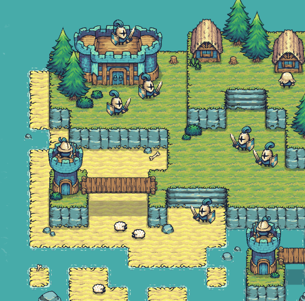

# My Awesome Go Game



## Overview
Welcome to **My Awesome Go Game**, a fast-paced and exciting game built using [Ebitengine](https://ebiten.org/)! This game combines fun gameplay mechanics with smooth performance, making it a must-play for Go and game development enthusiasts.

## Features
- 🎮 **Smooth gameplay** powered by Ebitengine
- 🕹️ **Responsive controls** for an immersive experience
- 🎨 **Pixel-art graphics** for a nostalgic feel
- 🔊 **Exciting sound effects** to enhance engagement
- 🚀 **Cross-platform compatibility** (Windows, macOS, Linux)

## Installation
1. Make sure you have Go installed ([Download Go](https://go.dev/dl/)).
2. Clone this repository:
   ```sh
   git clone https://github.com/yourusername/yourgame.git
   cd yourgame
3. Install your dependencies:
   ```sh
    go mod tidy
   ```
4. Run the game:
   ```sh
    go run main.go
   ```
